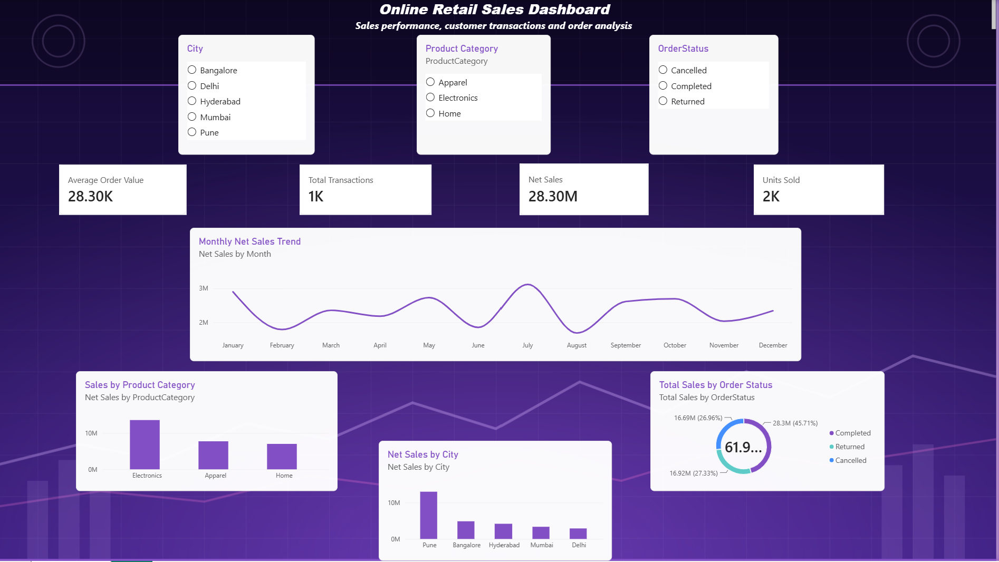

# Retail Transactions ETL & Power BI Dashboard

## Project Overview

This project analyzes retail transaction data using an end-to-end data analytics workflow.

The raw dataset was cleaned and transformed using Power Query (ETL), analyzed using DAX in Power BI, and presented through an interactive dashboard.

## Tools Used

- Microsoft Excel / CSV
- Power Query
- Power BI
- DAX

## ETL Process

The project follows these steps:

1. Imported the raw retail transaction dataset.
2. Cleaned and transformed the data using Power Query.
3. Standardized data types and values.
4. Removed duplicate records where required.
5. Created calculated columns during the transformation process.
6. Loaded the transformed data into Power BI.
7. Created DAX measures for business analysis.
8. Designed an interactive Power BI dashboard.

## DAX Measures

The dashboard includes measures such as:

- Net Sales
- Total Transactions
- Units Sold
- Average Order Value

## Dashboard Analysis

The dashboard provides insights into:

- Monthly Net Sales Trends
- Sales by Product Category
- Sales by Order Status
- Net Sales by City
- Total Transactions
- Units Sold
- Average Order Value

## Dashboard Preview

## Files in this Repository

- `Retail_Transactions_Raw.csv` - Original raw retail transaction dataset used as the input for the ETL process.
- `Retail_Transactions_dashboard.pbix` - Power BI file containing the Power Query transformations, DAX measures, and dashboard.
- `Retail_Transactions_dashboard.png` - Screenshot of the completed Power BI dashboard.

## Project Objective

The objective of this project is to demonstrate practical skills in:

- Data Cleaning
- ETL using Power Query
- Data Analysis
- DAX
- Data Visualization
- Power BI Dashboard Development

## Project Workflow

**Raw Data → Power Query ETL → Data Transformation → DAX Analysis → Power BI Dashboard**
